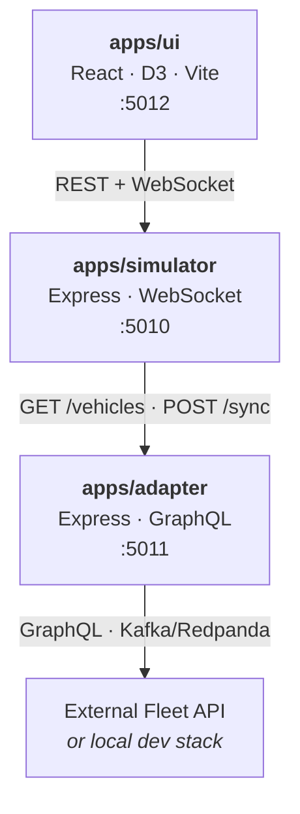
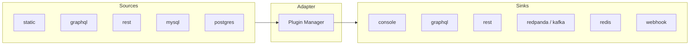

# Moveet

[](https://github.com/ivannovazzi/moveet/actions/workflows/ci.yml)
[](LICENSE)
[](https://nodejs.org/)
[](https://www.typescriptlang.org/)
[](apps/simulator/compose.yml)

A real-time vehicle fleet simulator built around provider-agnostic road-network data, with A\* pathfinding, realistic movement physics, and a custom browser-side route rendering engine.

<!-- Screenshot goes here -->

---

## Features

- **Map-data agnostic simulation core** -- ingests GeoJSON/OpenStreetMap-derived road graphs and can be adapted to any compatible road network dataset rather than a single baked-in map provider or city
- **A\* pathfinding on graph topology** -- computes routes with a haversine heuristic across bidirectional road segments and node-level connectivity
- **Multi-stop waypoint routing** -- chains A\* legs across ordered waypoint sequences with progress tracking per leg
- **Realistic vehicle motion model** -- updates each vehicle independently with acceleration, deceleration, and turn-speed reduction
- **Custom route drawing engine** -- renders roads, routes, vehicles, POIs, heat zones, and overlays through a D3-driven HTML/SVG scene instead of Leaflet, Mapbox, or a tile-widget dependency
- **Real-time state distribution** -- WebSocket streams push vehicle positions, route updates, heat zones, and simulation state to connected clients
- **Heat-zone generation** -- derives traffic density regions around high-connectivity intersections
- **Incidents & dynamic rerouting** -- operator-created road incidents trigger live A\* rerouting around blocked segments
- **Session recording & replay** -- record simulation sessions to NDJSON and replay them with pause, seek, and variable-speed controls
- **Interactive operator UI** -- icon-rail sidebar with fleet management, incident creation, dispatch controls, speed/toggle panels, and a replay timeline
- **Optional external integration** -- adapter service bridges to external fleet management APIs via GraphQL and Kafka/Redpanda

## Use Case

Moveet exists to generate realistic, moving vehicle data on real road networks -- the kind of data you need when building or testing fleet management software but don't have a fleet driving around.

Point it at any environment -- staging, CI, local dev -- and it will continuously produce GPS positions, speeds, and routes that behave like real vehicles: they follow actual roads, accelerate and brake through turns, and cluster in traffic zones. The adapter's plugin system lets you push that data wherever your application expects it.

## Architecture



The **simulator** is the core service and works standalone with synthetic vehicles plus a routable road-network graph. The **UI** connects to it for visualization and implements its own browser-native route/map drawing layer using React + D3 over HTML/SVG primitives. The **adapter** is only needed when integrating with external fleet management systems.

### Data Sources & Sinks

The adapter service uses a plugin architecture to connect the simulator to external systems. Plugins are hot-swappable at runtime via REST API, so you can reconfigure integrations without restarting.



Multiple sinks can be active simultaneously -- e.g. stream to Kafka for your event pipeline while also posting to a REST endpoint for a legacy system.

## Run with Docker

Pull and run the full stack — no clone or build needed:

```bash
curl -O https://raw.githubusercontent.com/ivannovazzi/moveet/main/docker-compose.ghcr.yml
docker compose -f docker-compose.ghcr.yml up
```

Open [http://localhost:5012](http://localhost:5012) to view the dashboard.

Images are published to GitHub Container Registry on every release:
- `ghcr.io/ivannovazzi/moveet-simulator`
- `ghcr.io/ivannovazzi/moveet-adapter`
- `ghcr.io/ivannovazzi/moveet-ui`

## Quick Start

### Prerequisites

- [Node.js](https://nodejs.org/) >= 18
- [npm](https://www.npmjs.com/) >= 9
- [Yarn](https://yarnpkg.com/) (for the UI project)
- [Docker](https://www.docker.com/) (optional, for containerized deployment)

### Install and Run

```bash
# Clone the repository
git clone https://github.com/ivannovazzi/moveet.git
cd moveet

# Install dependencies (npm workspaces + Turborepo)
npm install

# Start all services in development mode
npm run dev
```

This starts all three services via Turborepo. Alternatively, start them individually:

```bash
# Simulator only (port 5010)
npm run dev:sim

# UI only (port 5012)
npm run dev:ui

# Adapter only (port 5011)
npm run dev:adapter
```

Or run each project directly:

```bash
# Terminal 1: Simulator
cd apps/simulator && npm run dev

# Terminal 2: UI
cd apps/ui && yarn dev

# Terminal 3 (optional): Adapter
cd apps/adapter && npm run dev
```

Once running, open [http://localhost:5012](http://localhost:5012) to view the dashboard.

## Docker Compose

All three services can be run together with Docker Compose:

```bash
cd apps/simulator && docker compose up
```

## Project Structure

| Project | Path | Description | Port | Package Manager |
|---|---|---|---|---|
| **simulator** | [`apps/simulator/`](apps/simulator/) | Simulation engine -- map-data ingestion, road-network graph construction, A\* pathfinding, vehicle movement, REST API + WebSocket | 5010 | npm |
| **adapter** | [`apps/adapter/`](apps/adapter/) | Bridge service -- translates between simulator HTTP API and external systems (GraphQL, Kafka) | 5011 | npm |
| **ui** | [`apps/ui/`](apps/ui/) | Dashboard -- custom HTML/SVG rendering engine for roads, routes, vehicles, heat zones, POIs, and real-time operator controls | 5012 | yarn |

Each project has its own README with detailed architecture documentation.

## Tech Stack

| Layer | Technology |
|---|---|
| Language | TypeScript (ES2024 target) |
| Simulator | Node.js, Express, WebSocket (ws), Turf.js |
| UI | React 19, D3.js 7, Vite, Sass, CSS Modules |
| Adapter | Express, graphql-request, KafkaJS, ioredis |
| Testing | Vitest, Testing Library |
| Build | Turborepo, npm workspaces |
| Deployment | Docker, Docker Compose |

## Testing

Tests are written with [Vitest](https://vitest.dev/) across all projects. Run the full suite from the root:

```bash
npm test
```

Or run tests for a specific project:

```bash
# Simulator tests (pathfinding, heat zones, recording/replay, adapter, etc.)
cd apps/simulator && npm test

# UI tests (components, hooks)
cd apps/ui && yarn test
```

## Contributing

Contributions are welcome. Please see [CONTRIBUTING.md](CONTRIBUTING.md) for guidelines.

## Security

Please see [SECURITY.md](SECURITY.md) for reporting vulnerabilities.

## License

This project is licensed under the [MIT License](LICENSE).

Copyright (c) Ivan Novazzi
