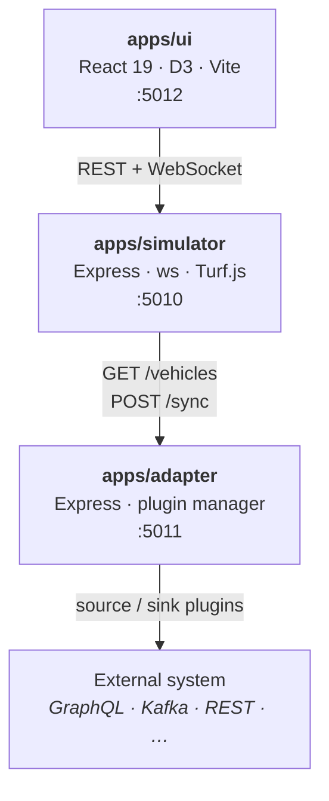
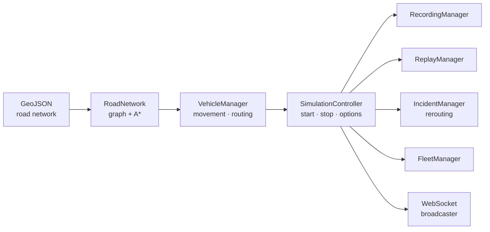
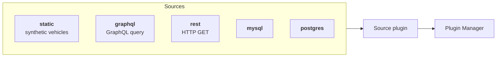
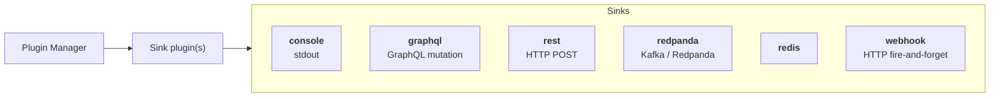

# Moveet

[](https://github.com/ivannovazzi/moveet/actions/workflows/ci.yml)
[](LICENSE)
[](https://nodejs.org/)
[](https://www.typescriptlang.org/)
[](apps/simulator/compose.yml)

A real-time vehicle fleet simulator that runs vehicles on actual road networks with A\* pathfinding, realistic motion physics, incident-based rerouting, session recording, and a custom browser-side map rendering engine — no map tile provider required.

<!-- Screenshot goes here -->

---

## Contents

- [Features](#features)
- [Quick start](#quick-start)
- [Architecture](#architecture)
- [Simulator API](#simulator-api)
- [WebSocket events](#websocket-events)
- [Adapter plugins](#adapter-plugins)
- [Configuration](#configuration)
- [Testing](#testing)
- [Docker](#docker)
- [Contributing](#contributing)

---

## Features

| | |
|---|---|
| 🗺 **Road-network agnostic** | Ingests any GeoJSON/OSM-derived road graph — swap the file to simulate a different city |
| 🔀 **A\* pathfinding** | Haversine heuristic over bidirectional road segments; supports single-destination and chained multi-stop waypoint routes; 500-entry LRU route cache |
| 🚗 **Realistic physics** | Per-vehicle speed variation, acceleration, deceleration, and turn-speed reduction; vehicles slow for heat zones |
| 🎨 **Custom map renderer** | D3 SVG scene with a Mercator projection (1×–15× zoom, pan); dedicated layers for roads, vehicles, POIs, heat-zone contours, incident markers, and dispatch routes — no Leaflet or Mapbox |
| 📡 **Real-time WebSocket** | 100 ms batched broadcast with backpressure handling; streams vehicle positions, routes, heat zones, incidents, fleet events, and replay frames |
| 🔥 **Heat zones** | Contour density map (green → red, 50 thresholds) derived from road-network intersection density |
| ⚠️ **Incidents & rerouting** | Operator-created road incidents trigger live A\* rerouting for all affected vehicles |
| 🎬 **Recording & replay** | NDJSON session recording; replay with pause, seek, and 1×/2×/4× speed controls and interpolated progress bar |
| 🚦 **Fleet management** | Group vehicles into named, colour-coded fleets; assign/unassign at runtime |
| 🔍 **POI + road search** | Typeahead combining road names and points of interest; dispatches selected vehicles to result |
| 🖥 **Operator UI** | Icon-rail sidebar (Vehicles · Fleets · Incidents · Recordings · Visibility · Speed · Adapter) + bottom dock with live and replay controls |
| 🔌 **Adapter plugins** | Hot-swappable source and sink plugins; configure via env vars or REST API at runtime |

---

## Quick Start

### Prerequisites

- **Node.js** ≥ 24, npm ≥ 9 (workspace root)
- **Yarn** (UI package)
- **Docker** (optional)

### Run locally

```bash
git clone https://github.com/ivannovazzi/moveet.git
cd moveet
npm install
npm run dev          # starts all three services via Turborepo
```

| Service | URL |
|---|---|
| Dashboard | http://localhost:5012 |
| Simulator API | http://localhost:5010 |
| Adapter API | http://localhost:5011 |

Or start services individually:

```bash
npm run dev:sim      # simulator only  :5010
npm run dev:ui       # UI only         :5012
npm run dev:adapter  # adapter only    :5011
```

---

## Architecture



**Simulator** is the core — it builds a routable graph from GeoJSON, runs vehicles with per-vehicle interval timers, and serves a REST API + WebSocket feed. It works completely standalone.

**UI** is a React app that renders everything in an SVG canvas using D3 with a Mercator projection. It has no map-tile dependency — roads, routes, heat-zone contours, POIs, incidents, and vehicles are all drawn from GeoJSON/API data.

**Adapter** is optional — only needed when you want to push data to an external fleet management system. It hot-swaps source and sink plugins at runtime via its own REST API.

### Simulator internals



---

## Simulator API

> Base URL: `http://localhost:5010`

### Simulation control

| Method | Path | Description |
|---|---|---|
| `GET` | `/status` | Simulation state (`running`, `ready`, `interval`) |
| `POST` | `/start` | Start simulation (accepts options body) |
| `POST` | `/stop` | Stop simulation |
| `POST` | `/reset` | Reset to initial state |
| `GET` | `/options` | Get current simulation options |
| `POST` | `/options` | Update simulation options |

### Vehicles & routing

| Method | Path | Description |
|---|---|---|
| `GET` | `/vehicles` | List all vehicle DTOs |
| `POST` | `/direction` | Dispatch one or more vehicles to a destination |
| `GET` | `/directions` | Get active direction assignments |
| `POST` | `/find-node` | Snap a lat/lng to the nearest graph node |
| `POST` | `/find-road` | Snap a lat/lng to the nearest road edge |
| `POST` | `/search` | Full-text POI search |

### Map data

| Method | Path | Description |
|---|---|---|
| `GET` | `/network` | Full road-network GeoJSON |
| `GET` | `/roads` | Road segments GeoJSON |
| `GET` | `/pois` | Points of interest |
| `GET` | `/heatzones` | Current heat zone features |
| `POST` | `/heatzones` | Regenerate heat zones |

### Fleets

| Method | Path | Description |
|---|---|---|
| `GET` | `/fleets` | List all fleets |
| `POST` | `/fleets` | Create a fleet |
| `DELETE` | `/fleets/:id` | Delete a fleet |
| `POST` | `/fleets/:id/assign` | Assign vehicles to a fleet |
| `POST` | `/fleets/:id/unassign` | Unassign vehicles from a fleet |

### Incidents

| Method | Path | Description |
|---|---|---|
| `GET` | `/incidents` | List active incidents |
| `POST` | `/incidents` | Create an incident (triggers rerouting) |
| `DELETE` | `/incidents/:id` | Clear an incident |
| `POST` | `/incidents/random` | Create a random incident |

### Recording & replay

| Method | Path | Description |
|---|---|---|
| `POST` | `/recording/start` | Start recording the session |
| `POST` | `/recording/stop` | Stop recording and save NDJSON file |
| `GET` | `/recordings` | List saved recordings |
| `POST` | `/replay/start` | Load and start a recording replay |
| `POST` | `/replay/pause` | Pause replay |
| `POST` | `/replay/resume` | Resume replay |
| `POST` | `/replay/stop` | Stop replay, return to live mode |
| `POST` | `/replay/seek` | Seek to a timestamp (ms) |
| `POST` | `/replay/speed` | Set playback speed multiplier |
| `GET` | `/replay/status` | Current replay state |

---

## WebSocket Events

Connect to `ws://localhost:5010`. On connect the server sends a `status` and `options` snapshot.

| Event | Direction | Payload |
|---|---|---|
| `vehicles` | server → client | Array of `VehicleDTO` (position, speed, heading, fleetId) |
| `status` | server → client | `SimulationStatus` (running, ready, interval) |
| `options` | server → client | Current `StartOptions` |
| `heatzones` | server → client | `HeatZoneFeature[]` |
| `direction` | server → client | Active dispatch assignment |
| `waypoint:reached` | server → client | Vehicle reached a waypoint |
| `route:completed` | server → client | Vehicle completed its full route |
| `reset` | server → client | Simulation was reset |
| `fleet:created` | server → client | New fleet |
| `fleet:deleted` | server → client | Fleet removed |
| `fleet:assigned` | server → client | Vehicles assigned to fleet |
| `incident:created` | server → client | New incident + affected vehicles |
| `incident:cleared` | server → client | Incident resolved |
| `vehicle:rerouted` | server → client | Vehicle rerouted around incident |

---

## Adapter Plugins

> Base URL: `http://localhost:5011`

### Runtime configuration API

| Method | Path | Description |
|---|---|---|
| `GET` | `/config` | Current source + sinks config |
| `POST` | `/config/source` | Swap the active source plugin |
| `POST` | `/config/sinks` | Replace the active sink list |
| `DELETE` | `/config/sinks/:type` | Remove one sink |
| `GET` | `/vehicles` | Vehicles from the current source |
| `GET` | `/fleets` | Fleets from the current source |
| `POST` | `/sync` | Push a position update through all sinks |
| `GET` | `/health` | Health check |

### Source plugins



| Plugin | Key config fields |
|---|---|
| `static` | `count` (default 20) |
| `graphql` | `url`, `query`, `token`, `headers`, `vehiclePath`, `maxVehicles` |
| `rest` | `url`, `token`, `headers`, `vehiclePath`, `maxVehicles` |
| `mysql` | `host`, `port`, `user`, `password`, `database`, `query` |
| `postgres` | `host`, `port`, `user`, `password`, `database`, `query` |

### Sink plugins



Multiple sinks run simultaneously. Configure via env vars or the runtime API:

```bash
# Env-var example: Redpanda + webhook
SOURCE_TYPE=graphql
SOURCE_CONFIG='{"url":"https://api.example.com/graphql","token":"..."}'

SINK_TYPES=redpanda,webhook
SINK_REDPANDA_CONFIG='{"brokers":"localhost:9092","topic":"fleet-updates"}'
SINK_WEBHOOK_CONFIG='{"url":"https://hooks.example.com/fleet"}'
```

---

## Configuration

### Simulator (`apps/simulator/.env`)

| Variable | Default | Description |
|---|---|---|
| `PORT` | `5010` | HTTP / WebSocket port |
| `GEOJSON_PATH` | `./export.geojson` | Path to the road-network GeoJSON file |
| `VEHICLE_COUNT` | `70` | Number of vehicles to spawn |
| `UPDATE_INTERVAL` | `500` | Position broadcast interval (ms) |
| `MIN_SPEED` | `20` | Minimum vehicle speed (km/h) |
| `MAX_SPEED` | `60` | Maximum vehicle speed (km/h) |
| `ACCELERATION` | `5` | Acceleration rate (km/h per tick) |
| `DECELERATION` | `7` | Deceleration rate (km/h per tick) |
| `TURN_THRESHOLD` | `30` | Bearing change (°) that triggers slowdown |
| `SPEED_VARIATION` | `0.1` | Random speed jitter factor `[0, 1]` |
| `HEATZONE_SPEED_FACTOR` | `0.5` | Speed multiplier inside heat zones |
| `ADAPTER_URL` | _(empty)_ | Enable adapter sync (e.g. `http://localhost:5011`) |
| `SYNC_ADAPTER_TIMEOUT` | `5000` | Adapter sync timeout (ms) |

### Adapter (`apps/adapter/.env`)

| Variable | Default | Description |
|---|---|---|
| `PORT` | `5011` | HTTP port |
| `SOURCE_TYPE` | `static` | Active source plugin |
| `SOURCE_CONFIG` | `{}` | JSON config for the source plugin |
| `SINK_TYPES` | _(empty)_ | Comma-separated sink plugin names |
| `SINK_<TYPE>_CONFIG` | `{}` | JSON config per sink, e.g. `SINK_REDPANDA_CONFIG` |

---

## Testing

Tests use [Vitest](https://vitest.dev/) across all three projects (~445 tests total).

```bash
npm test                          # all projects via Turborepo
cd apps/simulator && npm test     # simulator (~290 tests)
cd apps/ui && yarn test           # UI (~75 tests)
cd apps/adapter && npm test       # adapter (~80 tests)
```

Simulator test coverage includes: road-network graph, A\* pathfinding, vehicle movement, heat zones, fleet management, incident rerouting, recording/replay lifecycle, rate limiter, geospatial helpers, serializer, config validation, and `SimulationController` lifecycle.

---

## Docker

### Pull and run (no build needed)

```bash
curl -O https://raw.githubusercontent.com/ivannovazzi/moveet/main/docker-compose.ghcr.yml
docker compose -f docker-compose.ghcr.yml up
```

Open [http://localhost:5012](http://localhost:5012).

Images (published on every release via GitHub Container Registry):

```
ghcr.io/ivannovazzi/moveet-simulator
ghcr.io/ivannovazzi/moveet-adapter
ghcr.io/ivannovazzi/moveet-ui
```

### Build from source

```bash
cd apps/simulator && docker compose up
```

---

## Project Structure

| Package | Path | Tech | Port |
|---|---|---|---|
| **simulator** | [`apps/simulator/`](apps/simulator/) | Node.js 24 · Express 4 · ws 8 · Turf.js 7 | 5010 |
| **adapter** | [`apps/adapter/`](apps/adapter/) | Node.js 24 · Express 4 | 5011 |
| **ui** | [`apps/ui/`](apps/ui/) | React 19 · D3 7 · Vite · TypeScript 5.8 · CSS Modules | 5012 |

Each package has its own README with deeper architecture notes.

---

## Contributing

Please read [CONTRIBUTING.md](CONTRIBUTING.md) before opening a PR.

## Security

See [SECURITY.md](SECURITY.md) for the vulnerability disclosure policy.

## License

[MIT](LICENSE) © Ivan Novazzi

