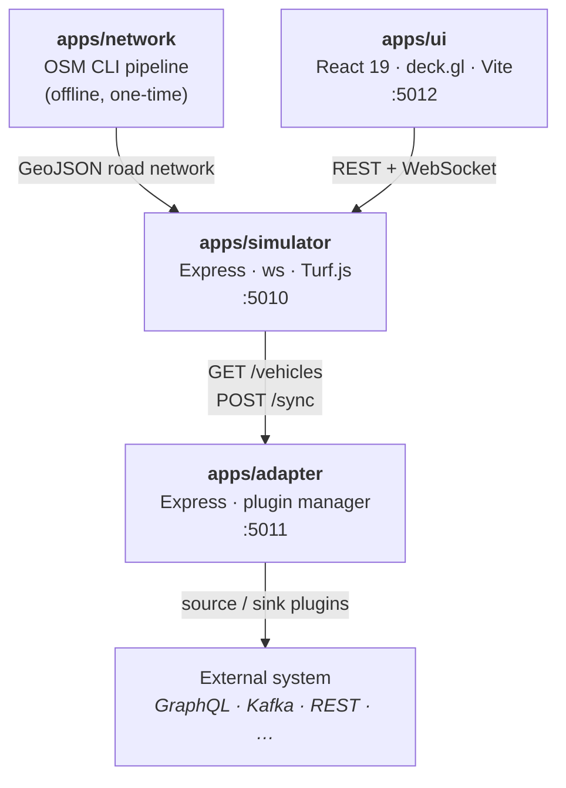

# Moveet

[](https://github.com/ivannovazzi/moveet/actions/workflows/ci.yml)
[](LICENSE)
[](https://nodejs.org/)
[](https://www.typescriptlang.org/)
[](docker-compose.yml)

Moveet drives simulated vehicles over real OpenStreetMap road networks and streams their positions in real time. Vehicles route with A\*, slow for traffic and turns, reroute around incidents, and cross geofences. A WebGL map renders the whole fleet without a tile provider.

Use it to develop against a fleet API before real vehicles exist, to load-test a telemetry pipeline, or to replay a scripted scenario in CI.

<!-- Screenshot goes here -->

## Quick start

You need Node.js ≥ 26 and a road network at `apps/simulator/data/network.geojson`.

```bash
npm install
npm run dev:sim     # simulator on :5010
npm run dev:ui      # UI on :5012, in a second terminal
```

Open [http://localhost:5012](http://localhost:5012). The simulator runs standalone with synthetic vehicles — the adapter is optional.

No road network yet? Build one for any city with the [network CLI](apps/network/):

```bash
cd apps/network && npm run dev -- prepare nairobi
```

This downloads OSM data from Geofabrik, clips a bounding box, keeps the drivable road classes, and writes GeoJSON straight into `apps/simulator/data/`. It needs [osmium-tool](https://osmcode.org/osmium-tool/) ≥ 1.14 installed locally, and runs offline after the first download.

Prefer Docker? Skip the build entirely:

```bash
curl -O https://raw.githubusercontent.com/ivannovazzi/moveet/main/docker-compose.ghcr.yml
docker compose -f docker-compose.ghcr.yml up
```

The images do not bundle a road network, so mount your own GeoJSON or edit the volume in the compose file.

## What it does

**Routing that respects the map.** A\* with a landmark heuristic over a bidirectional road graph, honouring turn restrictions, roundabouts, and road-class access rules. Routes cache, and invalidate when an incident lands on them.

**Motion that looks real.** Five vehicle types with distinct speed and acceleration profiles, BPR congestion, rush-hour and night demand curves, traffic-signal delays at intersections, and surface-smoothness penalties.

**A map with no tile provider.** deck.gl and luma.gl draw roads, vehicles, routes, heat-zone contours, POIs, incidents, geofences, and breadcrumb trails as GPU layers over a Web Mercator viewport. No Leaflet, no Mapbox, no API key.

**Operator controls.** Dispatch jobs with two map clicks and watch them through the full pickup-to-dropoff lifecycle with per-leg ETAs and SLA tracking. Draw geofences, create incidents and see vehicles reroute live, group vehicles into fleets, and search roads and POIs from a ⌘K palette.

**Faults on purpose.** Inject frozen GPS, clock skew, duplicate and out-of-order messages, battery death, and teleport spoofing per vehicle — reproducible under a fixed seed, so a consumer can be tested against bad data deliberately.

**Sessions you can replay.** Record to NDJSON and replay with pause, seek, and 1×/2×/4× speed. Scenarios run headlessly with assertions and a pass/fail grade, which makes them usable as CI tests.

**Somewhere to send it all.** The optional adapter pushes telemetry to an external system through hot-swappable sink plugins — GraphQL, REST, Kafka/Redpanda, Redis, webhook, or stdout — configured by env var or at runtime over its REST API.

## Architecture


```mermaid
flowchart TD
    NET["<b>apps/network</b><br/>OSM CLI pipeline<br/>(offline, one-time)"]
    UI["<b>apps/ui</b><br/>React 19 · deck.gl · Vite<br/>:5012"]
    SIM["<b>apps/simulator</b><br/>Express · ws · Turf.js<br/>:5010"]
    ADP["<b>apps/adapter</b><br/>Express · plugin manager<br/>:5011"]
    EXT["External system<br/><i>GraphQL · Kafka · REST · …</i>"]

    NET -- "GeoJSON road network" --> SIM
    UI -- "REST + WebSocket" --> SIM
    SIM -- "GET /vehicles<br/>POST /sync" --> ADP
    ADP -- "source / sink plugins" --> EXT
```

The **simulator** is the core. It builds a routable graph from GeoJSON, moves vehicles on per-vehicle interval timers, and serves a REST API plus a WebSocket feed. Everything else is optional around it.

The **UI** renders that feed on a WebGL canvas. The **adapter** bridges to an external fleet system. The **network** CLI is an offline one-time step that produces the GeoJSON.

| Package | Path | Tech | Port |
| --- | --- | --- | --- |
| **network** | [`apps/network/`](apps/network/) | Commander · osmium-tool | CLI |
| **simulator** | [`apps/simulator/`](apps/simulator/) | Express 4 · ws 8 · Turf.js 7 | 5010 |
| **adapter** | [`apps/adapter/`](apps/adapter/) | Express 4 | 5011 |
| **ui** | [`apps/ui/`](apps/ui/) | React 19 · deck.gl 9 · Vite · Tailwind v4 | 5012 |

Two workspace packages carry cross-app code. [`@moveet/shared-types`](packages/shared-types/) owns the contracts — the WebSocket message union and the REST DTOs — so a payload change fails to compile on the other side. [`@moveet/server-kit`](packages/server-kit/) holds the shared server runtime: correlation-id and error middleware, a pino logger with secret redaction, and a retrying HTTP client.

Each package has its own README with deeper notes.

## API

The REST and WebSocket surfaces are specified, and CI fails if either drifts from the code:

- [`apps/simulator/openapi.yaml`](apps/simulator/openapi.yaml) — the REST surface
- [`apps/simulator/asyncapi.yaml`](apps/simulator/asyncapi.yaml) — the WebSocket message union
- `npm run check:api-specs` — verifies both against the implementation

Read those rather than a table in a README, which is how the previous one went stale. The simulator serves browsable docs at [`/api-docs`](http://localhost:5010/api-docs) while running, and [`apps/simulator/README.md`](apps/simulator/README.md) walks through the endpoints with examples.

## Configuration

Each app reads its own `.env`. The settings you are most likely to change:

| Variable | Default | What it does |
| --- | --- | --- |
| `GEOJSON_PATH` | `./data/network.geojson` | Road network to load |
| `VEHICLE_COUNT` | `70` | Vehicles to spawn |
| `UPDATE_INTERVAL` | `500` | Position broadcast interval (ms) |
| `ADAPTER_URL` | _(empty)_ | Set it to enable adapter sync |
| `WS_TRANSPORT` | `inprocess` | `redis` moves fan-out to a standalone gateway |

Speed, acceleration, turn thresholds, heat-zone penalties, and the adapter's source and sink plugin config are documented in full in [`apps/simulator/README.md`](apps/simulator/README.md) and [`apps/adapter/README.md`](apps/adapter/README.md).

## Development

```bash
npm test              # every workspace, via Turborepo
npm run type-check
npm run lint
npm run check:api-specs
```

Tests run on Vitest across all six workspaces, with coverage thresholds enforced in CI. Both Node services expose Prometheus metrics at `/metrics`, and an `x-request-id` flows end to end, through the adapter and into the telemetry envelope as `correlation_id`.

To build the images from source instead of pulling them:

```bash
docker compose up --build
```

All three targets — `simulator`, `adapter`, `ui` — come from the single workspace-aware root `Dockerfile`. To scale WebSocket fan-out onto a standalone gateway backed by Redis, enable the optional `scale` profile:

```bash
WS_TRANSPORT=redis REDIS_URL=redis://redis:6379 docker compose --profile scale up --build
```

## Contributing

Read [CONTRIBUTING.md](CONTRIBUTING.md) before opening a PR. Security policy is in [SECURITY.md](SECURITY.md).

## License

[MIT](LICENSE) © Ivan Novazzi
